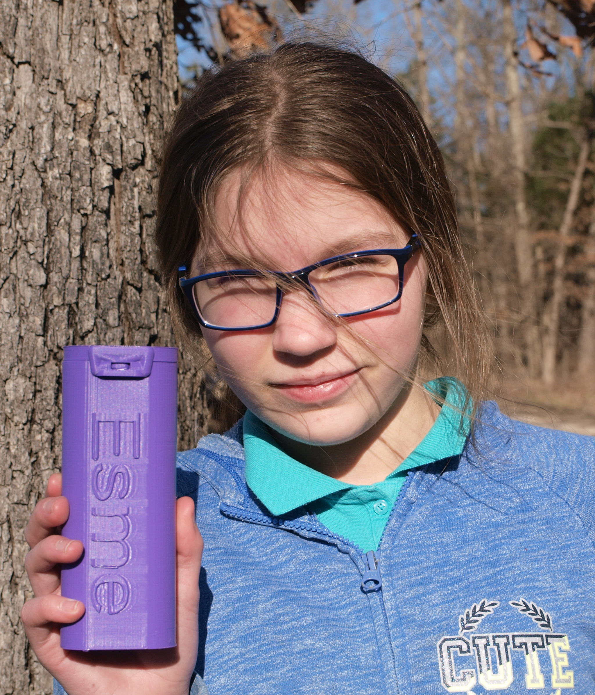
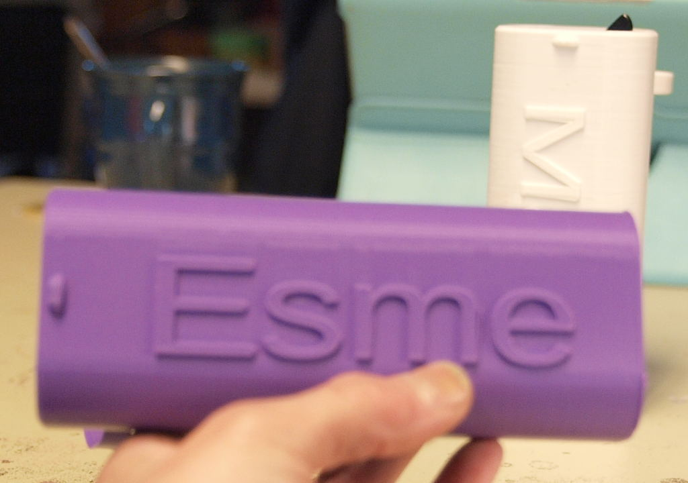
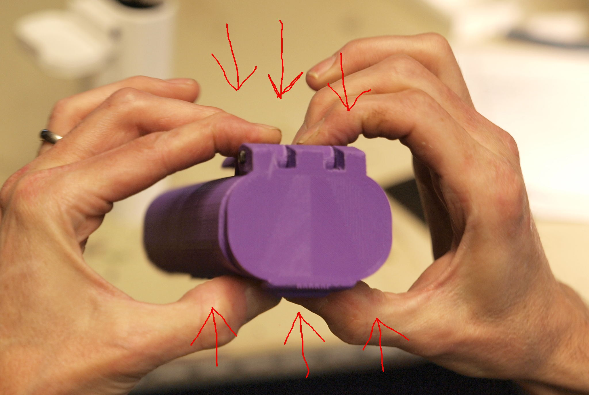
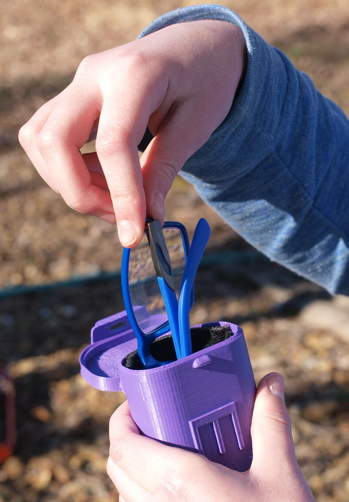
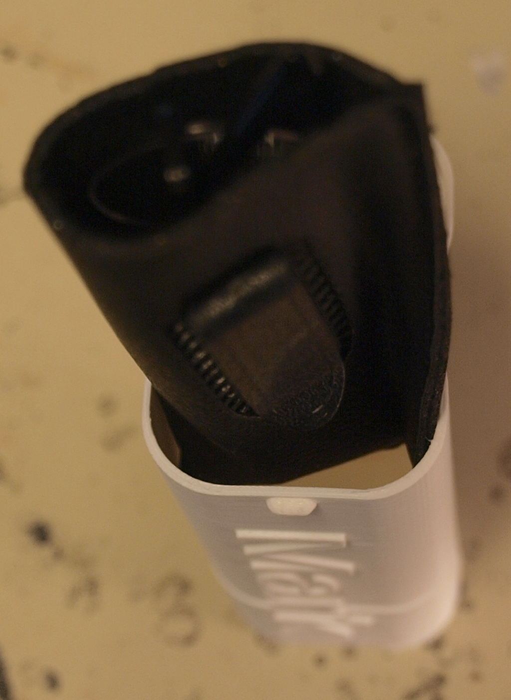
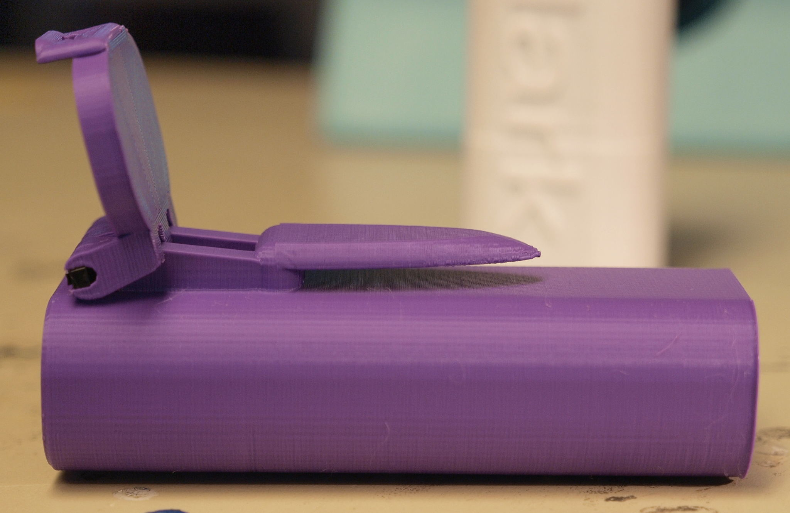

# Mark's Enclosure Helper - Eyeglass Belt Case

Our daughter, Esme, got her first pair of eye glasses recently. Being
an American pre-teen her normal wardrobe has no place for her to keep
them safely as she goes about her daily activities. She needs a case
which that can attach to her clothing or back pack, that's tough
enough to survive the hectic and physical life she leads.

This is after school the first day she's used this outside. It
survived!

We've designed this box to be slightly difficult to open; the hinges
are offset slightly which adds extra "spring" to the top when its
closed. The hope is the box will open only by intent and effort and
accidental bumps and scrapes will not knock the lid loose.

Squeezing the front and back faces of the box together as shown should
result in the top popping up, possibly a small amount of force of the
clasp will be needed. Ours just pop open. 

You will need to line the box interior with something to keep the
lenses of eye glasses from getting scratched up by the plastic. We
sized the box to fit a pair of glasses in the cheap foam / leatherette
'reading glasses' cases we found to be ubiquitously available. Folded
a little bit and with the top trimmed it provides padding and
protection, and enough spare space for a pencil.

>(This box suffered a layer shift during printing, but is still strong
>enough and pretty enough for what we needed).

We've provided STL files of a belt clip version (open on one side) and
a belt loop (closed on both sides of the loop). An adult size belt
will be thicker than the 5mm opening this model has. That size is
good for the camera bag strap we need it for.

====================================
## Printing

We've printed these in PLA with a 0.5mm nozzle, with support material
and brims. 

We suggest very high infill and/or soilid infill especially for the
body of the hinge and belt clip areas. 

We are using Slic3rPE, and the `solid infill threshold area` setting
in `Print Settings > Infill` is the variable that might cause the
infill to switch to solid in that part of the object if you have
trouble tracking that down. Other slicers certainly have a similar
value but we can't guide you about them.

See the [Box Assembly](../REFERENCE.md#box-assembly) instructions for
details of how to use two zip ties as hinge pins. an M3x40mm screw and
nut would also work (and have less play in the action) but those tend
to be expensive and hard to source.

====================================
## Design

The `hinge_standoff` value makes the top more firm when closed, by
changing the geometry of rotation of the lid when it opens. "The tooth
drags the catch harder" is the best explaination we can offer at the
moment. This also gives the top the "pop" spring when it opens.

The `catch_thick` at 3mm is **Very** thick for use, we hope its thick
enough to survive hard usage. Smaller fingers and gentler
circumstances would almost certainly find the catch easier to use with
a `catch_thick` of down to 1.5mm or so, and you might even want to
turn the `wall_thick` back down a hair.

The `hinge_basepoint` is set fairly arbitraily at 100mm, move it
freely for a different balance point, the box top hinges will need
room to fit when its open but otherwise the clip could run right up to
the top.

-------------------------------
   Copyright (c) 2019 Mark and Marie Lamb. Distributed under GPLv3, see LICENSE file for terms.

We hope you find this code useful, and ask that you **[hit this donate
link](https://www.paypal.com/cgi-bin/webscr?cmd=_s-xclick&hosted_button_id=J3AY8SM43A2DA&source=url)**
please.
